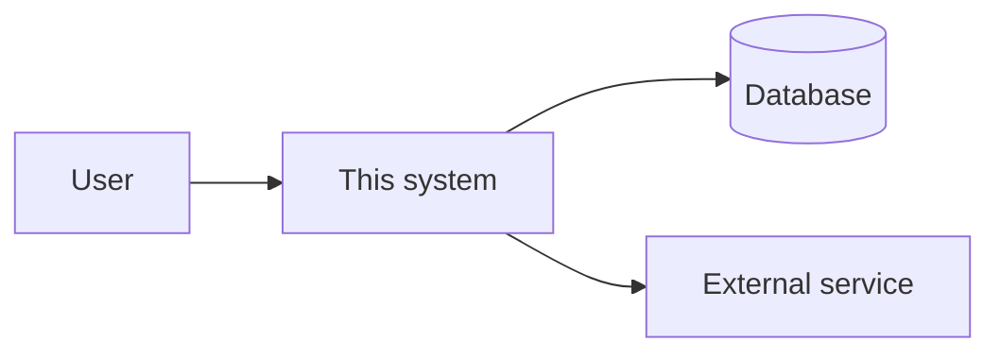

## Responsibility

What this system owns, in two sentences. What it explicitly does not own.

## Context diagram

## Dependencies

| Dependency | Direction | Protocol | Contract | Failure impact |
| --- | --- | --- | --- | --- |

## Key flows

- [Flow name](sequence-flow.md)

## Decisions

- [ADR-0001](adr/0001-example.md)
