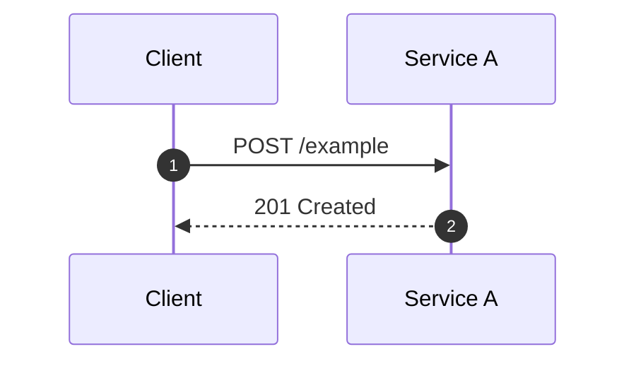

## Purpose

One paragraph: which business flow this covers, what triggers it, what
"done" means.

## Actors

| Actor | Role in this flow | Owner |
| --- | --- | --- |
| Client | | |
| Service A | | |

## Sequence

## Steps

| # | From → To | Message | Contract | Notes / failure handling |
| --- | --- | --- | --- | --- |
| 1 | Client → Service A | POST /example | [Example API](api-example.md) | |

## Failure modes

| Failure | Detected at step | Behaviour | Retry / compensation |
| --- | --- | --- | --- |

## Related

- Jira:
- Decisions:
